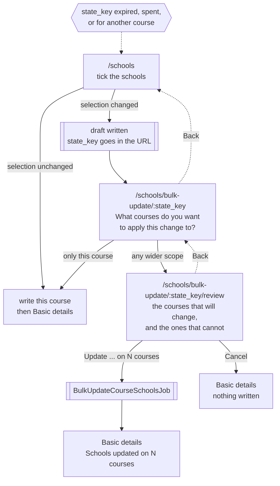
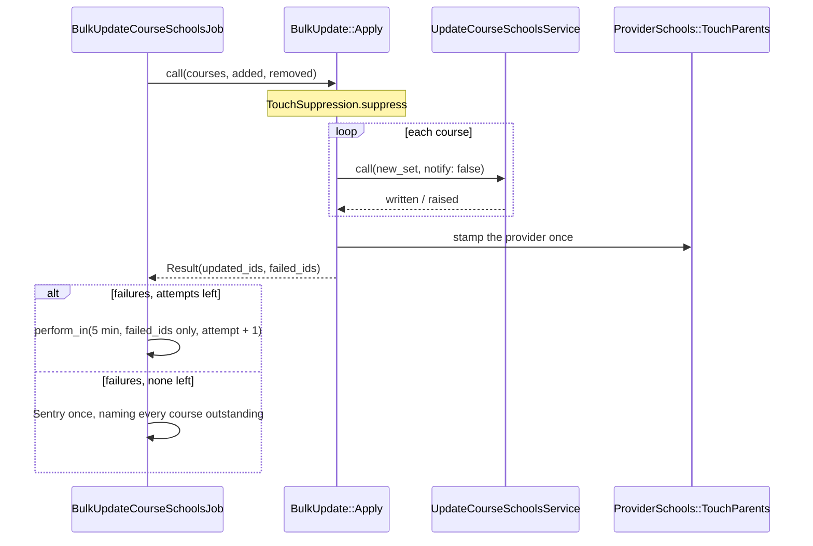

# Bulk updating placement schools

Applying one placement school change to many of a provider's courses at once.
Large providers were editing the same school course by course, across hundreds of
courses.

The attach page no longer writes. It records what was ticked and hands it on; the
change is written once the provider has said which courses it is for.

## The flow



Every bulk page is a GET keyed by the state key, so Back and refresh both work.
Back to `/schools` carries the key, so the boxes show what was ticked rather than
what the course holds — nobody re-ticks three hundred schools.

## Where the change lives

`Publish::Schools::BulkUpdate::Draft`, in `Rails.cache` for 24 hours. The session
is a cookie store, so it cannot hold hundreds of UUIDs; a query string cannot
either. Same pattern as the add-course wizard.

| Field | Why |
|---|---|
| `school_uuids` | what was ticked |
| `baseline_uuids` | what was attached **when the page was served** |
| `scope` | the radio answer, once given |

Key is `course_schools_bulk_update_{provider}_{cycle}_{course}_{state_key}`, so a
key issued for one course cannot resolve against another.

The baseline travels rather than being re-read. The pages play back a diff and
the write applies that same diff, so both must measure against the schools the
provider was looking at — not whatever the course holds when they press the
button.

## The two rules

**The change is a diff, not a list.** Each course keeps what it has, gains the
additions, loses the removals. Two courses that differed still differ afterwards.

```
new_set = (course's schools ∪ added) − removed
```

Applying it twice lands on the same schools, which is why a duplicate submit is
harmless and the draft is only deleted after the job is safely queued.

**A course cannot be left with no schools.** One whose every school is being
removed is set aside under *These courses will not be updated*, unless support
has exempted it (`publish_without_schools_allowed`). Since a course gains
whatever is being added, that can only happen when the change adds nothing — so
the question is only asked on a pure removal.

A course that already had no schools is not set aside: it is not losing its last
one, and the explanation would not be true of it.

## The write



Queued, always: a bulk update writes school relationships *and* their legacy site
statuses for every course it matches, and the single-course write is already
queued above thirty schools.

`changed_at` is `UNIQUE` on both `course` and `provider`, so an unsuppressed run
would put thousands of writes on one provider row. Touches are suppressed and the
provider is stamped once; each course still gets its own timestamp from its own
save.

`notify: false` — the notification is per course, and one change across hundreds
of them would be hundreds of emails saying the same thing.

A course that fails does not hold up the rest and is not dropped: the job comes
back for those alone. Anything escaping `Apply` entirely still bubbles, and
Sidekiq retries as it would any job. Per-course failure is ours; whole-job
failure is Sidekiq's.

## The pieces

| | Owns |
|---|---|
| `Publish::Courses::SchoolsController` | the attach page; hands over or writes |
| `…::Schools::BulkUpdatesController` | the options page |
| `…::Schools::BulkUpdateReviewsController` | the review page, and confirming |
| `Publish::Schools::BulkUpdateDraft` *(concern)* | course + draft + the expiry redirect, shared by both bulk controllers |
| `BulkUpdate::Draft` / `::Repository` | the unapplied change |
| `BulkUpdate::Scope` | **the scope vocabulary** — one object per radio, holding both its label and the courses it means |
| `BulkUpdate::MatchedCourses` | splits the matched courses into will / will not |
| `BulkUpdate::Apply` | the write, one course at a time |
| `Publish::Schools::SchoolChanges` | what is being added and removed |

`Scope` is the single source of that vocabulary: the form, the page and the write
all read it, so what the provider was offered, what they were shown and what got
written cannot drift apart.

### The radios

| Token | Label | Matches | Shown |
|---|---|---|---|
| `only_this_course` | Only this course - *name (code)* | this course | always, above the "or" divider |
| `funding` | All fee-paying / school direct salaried / apprenticeship courses | same `funding` | always |
| `secondary` | All secondary courses | `secondary_course` | secondary courses only |
| `subject` | All *subject* courses | same subject; same `level` for primary and further education | when there is a subject to name |
| `all` | All courses | every course in the cycle | always |

Primary and further education are treated as subjects, so they name and match
their level. Nothing is pre-selected, and a scope the course was never offered is
rejected rather than quietly matching.

## Playing the change back

`Publish::Schools::ChangesListComponent` on both bulk pages: *You are adding N
schools*, *You are removing N schools*, or *all schools in your list* either way.
Both lists move into `details` at nine or more — both together, since one open
beside one closed reads as though the closed half mattered less.

It is the server-rendered twin of `ChangesSummaryComponent`, which the browser
fills in on the attach page as the provider ticks. They share their wording
(`publish.schools.changes.*`) and their logic is mirrored case for case —
`SchoolChanges` against `schools_changes.js`, including the asymmetric "all":
every school ticked, or none left ticked.

## Two things to know before changing it

**The exclusion subqueries are bounded on purpose.** They are correct unbounded,
but Postgres answers an unbounded `IN` over `course_school` by materialising the
whole table and rescanning it once per matched course — 1.7s for a 150-course
provider, on a page they are only reading. Scoped to the matched ids: 12ms.

**Confirming does not build the list.** `MatchedCourses#ids` is
`matched_ids - excluded_ids`, not the list query. That holds only because
`Publish::Courses::Query` LEFT joins everything it joins, so no matched course is
dropped. A spec pins it.
