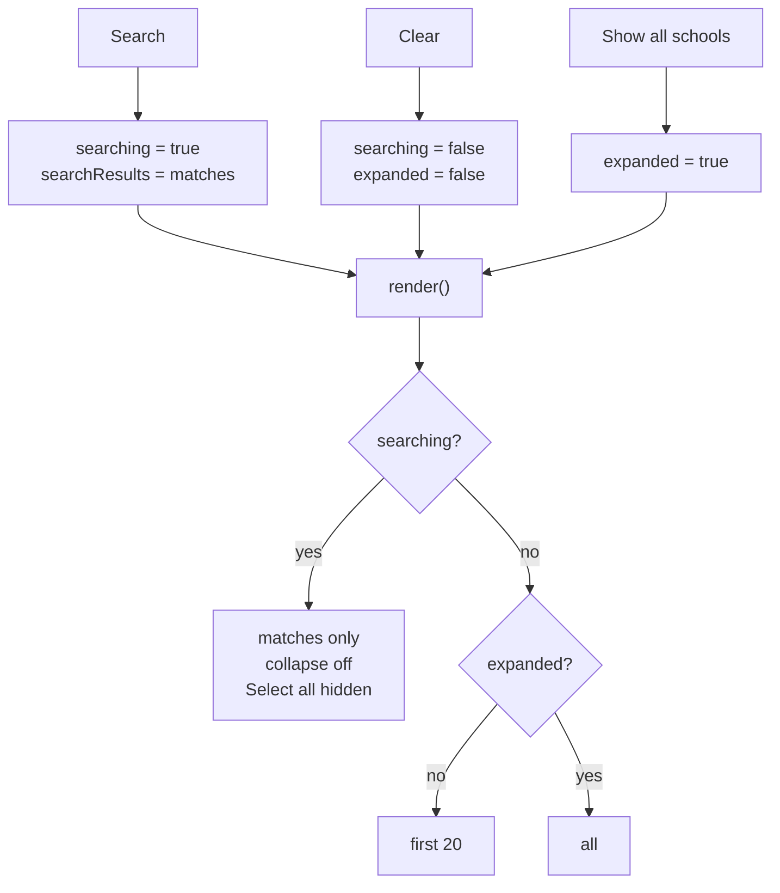
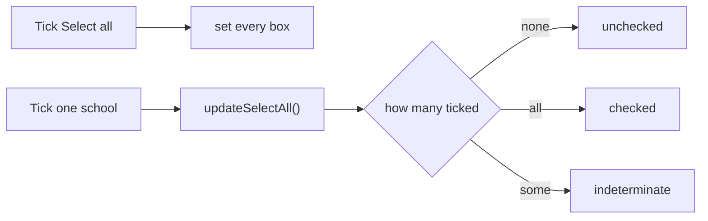
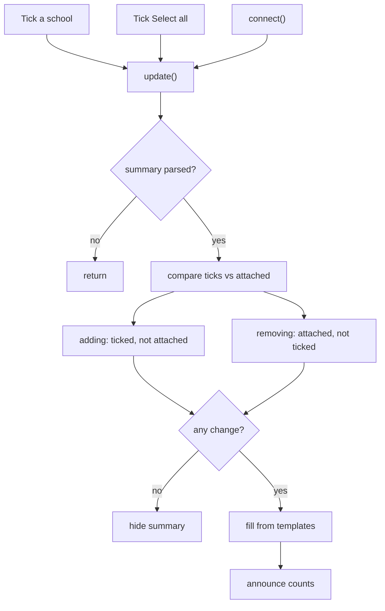

# Placement schools controllers

Three Stimulus controllers, on `courses/schools/edit` and the wizard's schools step.
All wiring is explicit `data-action`. No custom events.

| Controller | Owns | Wizard? |
|---|---|---|
| `schools-list` | search box + which rows are visible | yes |
| `select-all-checkboxes` | bulk ticking | no |
| `schools-changes` | summary of what changed | yes |

## The row

Each controller that reads a checkbox declares itself on it.

```erb
data: {
  select_all_checkboxes_target: "checkbox",       # edit page only
  schools_list_target:          "schoolCheckbox",
  schools_changes_target:       "school",
  school_name: school.location_name,
  action: "select-all-checkboxes#updateSelectAll schools-changes#update",
}
```

No event prefix → Stimulus binds both to `input`.

---

## schools-list

Search and collapse both decide visibility. Neither writes to rows; both feed `render()`.

**Targets** `schoolCheckbox` `showAll` `bulkSelect` · `panel` `autocomplete` `status` `noResults`
**Values** `collapseAfter` (Number, default 20)

| Trigger | Method | Effect |
|---|---|---|
| page load | `connect` | `clear()`, then enhance the search box if a panel exists |
| Enter in search box | `keydown` | swallows Enter so it can't submit the form; searches unless the menu is open |
| Search button | `search` | sets `searching` + `searchResults`, renders, announces count |
| Clear search | `clearSearch` | resets box, `clear()`, focus back to box |
| Show all schools (no results) | `showAllSchools` | resets box, `clear()`, focus to first row |
| Show all schools (collapsed) | `showAll` | `expanded = true`, focus to first revealed row |
| teardown | `disconnect` | destroys the autocomplete |



- Rows are hidden, never removed — a ticked school filtered out of view still submits.
- Select all is hidden while searching: it takes in every school, not just the matches.
- `enhanceSearch` is guarded on `hasAutocompleteTarget`, so a page without a panel still collapses.

---

## select-all-checkboxes

Also used by `support/feedbacks`, so it stays separate.

**Targets** `selectAll` `checkbox`

| Trigger | Method | Effect |
|---|---|---|
| page load | `connect` | `updateSelectAll()` |
| tick Select all | `toggleAll` | sets `.checked` on every box |
| tick one school | `updateSelectAll` | recomputes the tri-state |



`toggleAll` sets `.checked` in code, so **no event fires on those boxes**. Select all
therefore carries `schools-changes#update` itself.

---

## schools-changes

**Targets** `summary` `added` `removed` `status` `school` · `countTemplate` `itemTemplate` `messageTemplate`
**Values** `attached` (Array)

| Trigger | Method | Effect |
|---|---|---|
| page load | `connect` | `update()` — so a re-render after a validation error is right on arrival |
| tick one school | `update` | recompute, fill, announce |
| tick Select all | `update` | same — reached from Select all's own action |



`attached` comes from the server, never the boxes: after a validation error the form
re-renders from submitted params, so the boxes no longer hold the baseline.

| Page | Baseline |
|---|---|
| Edit | `CourseSchoolForm#attached_school_uuids` — schools on the course |
| Wizard | `Steps::Schools#attached_school_uuids` — state store, not the step |

All ticked → "adding all schools". None ticked → "removing all schools". End state
decides, not which control got there.

**Rendering** — `message()` and `counted()` clone a `<template>` from the component and set
`textContent`. No GOV.UK classes in JS, and `&` in a school name survives.

**Announcement** — visually hidden `role="status"`. Counts only: "Adding 1 school.
Removing 2 schools." Names are already on screen; forty read aloud per tick would be unusable.
