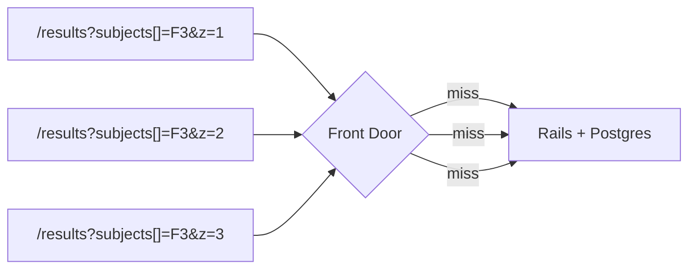
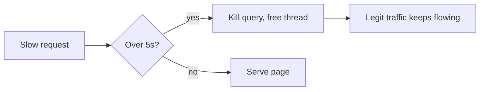
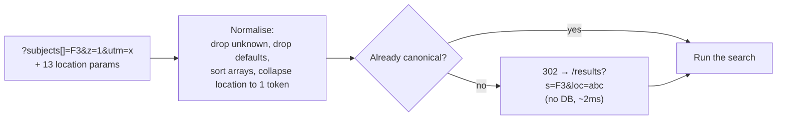
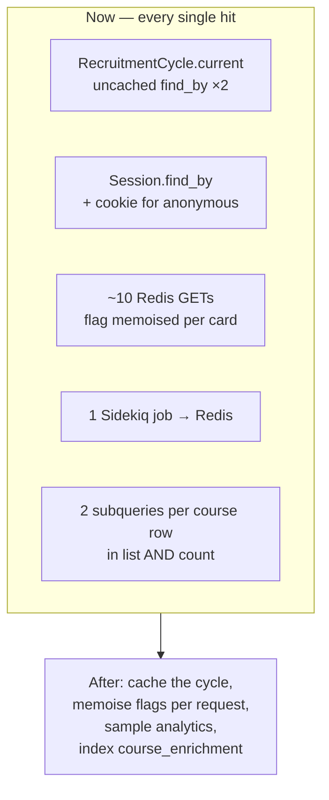
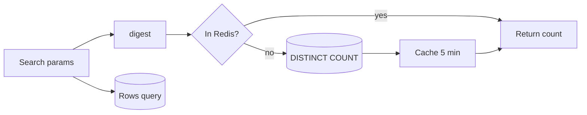
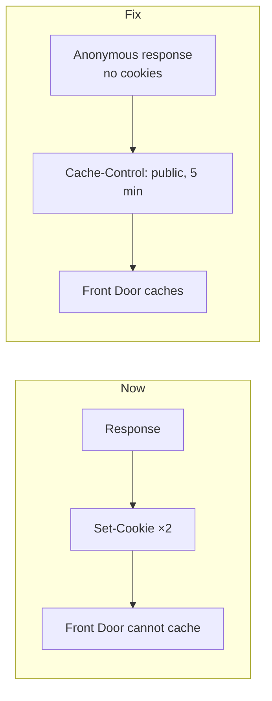
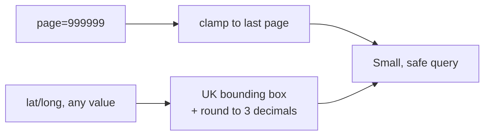
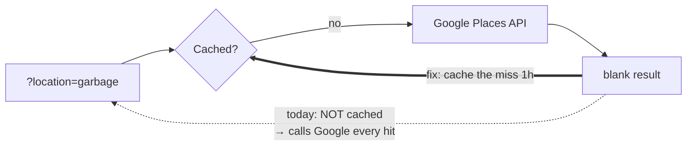
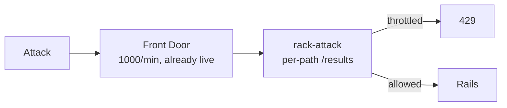
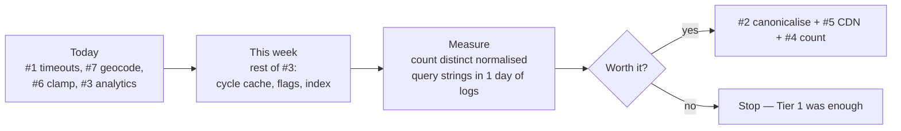

# Find `/results` — surviving a DDoS

What the app can do while Infra handles rate limiting and country blocking.

## The shape of the problem

`/results` has a huge number of possible URLs:

- `subjects[]` over ~50 subjects (any subset), plus `subject_code`
- `funding[]`, `qualifications[]`, `study_types[]`, `start_date[]`
- 6 booleans, `minimum_degree_required`, `order`, `radius`, `level`, `provider_code`, `excluded_courses[]`, unbounded `page`
- **13 loose location params** — `latitude`, `longitude`, `formatted_address`, `postal_code`, `postal_town`, `route`, `locality`, `administrative_area_level_1/2/4`, `address_types[]`, `country`, `short_address`

`ActiveFiltersComponent#remove_path` (`active_filters_component.rb:27`) puts **all 13** into every "remove filter" link. Real URLs are already near-unique.

**So CDN caching alone will not save us.** Front Door keys on the query string; an attacker adds `&z=random` and every hit misses.

Also today: Puma runs **1 process / 5 threads**, DB pool 5, no `rack-timeout`, no `statement_timeout`. Five slow queries block a pod.

---

# Tier 1 — works no matter what the attacker sends

## 1. Timeouts

Add `statement_timeout` in `database.yml` and the `rack-timeout` gem.

- ✅ Stops any attack shape, including cache-busting.
- ✅ Config-level change.
- ⚠️ Slow-but-real searches start failing. Pick the limit from real p99s.
- ⚠️ `Errorable` rescues `StandardError`, so a timeout renders the full 500 page. Needs a cheap static response.

## 2. Canonicalise the URL, then redirect

- ✅ The change that makes everything below work. Cache-busting becomes a cheap redirect.
- ✅ Shrinks the URL space massively; shortens URLs.
- ⚠️ Two requests instead of one for old links. Measure the redirect ratio first.
- ⚠️ Can break bookmarks, emailed searches, email-alert links (`_all.html.erb:11`) and `utm_*` attribution.
- ⚠️ Real work. `SearchForm` ties ordering and radius to `previous_location_category` — naive normalising changes results.

## 3. Cut the fixed cost every request pays

| Cost | Where |
|---|---|
| `RecruitmentCycle.current` uncached, called 2× | `query.rb:19`, `query.rb:271` |
| `Session.find_by` + signed cookie for every anonymous visitor | `authentication.rb:31`, `:105` |
| `FeatureFlag.active?` memoised **per card**, not per request | `summary_card_component.rb:68` |
| Sidekiq enqueue to the same Redis we cache in | `results_controller.rb:31` |
| Two correlated subqueries per candidate row | `query.rb:552` (`published_course_sql`) |

- ✅ Pure overhead removal. No behaviour change, no cache-hit assumptions.
- ✅ `course_enrichment` only has an index on `course_id` (`schema.rb:254`). Adding `(course_id, status)` helps every query.
- ⚠️ A denormalised `findable` column is faster but needs invalidating on every publish/withdraw/rollover. Stale course states are worse than slow ones. Index first.
- ⚠️ Sample analytics, don't disable — we want the telemetry during an attack. Put it behind a live flag.

## 4. Cache the count

`count` (`query.rb:81`) is a second full `DISTINCT` over the same joins.

- ✅ Halves DB work. Same count serves every page of a search.
- ⚠️ Hit rate depends on #2 landing first.
- ⚠️ Stale count above fresh rows is user-visible. Minor at a 5-minute TTL.

---

# Tier 2 — needs the URL space collapsed first

## 5. Let the CDN cache `/results`

Two cookie writes block caching outright: the signed session cookie for anonymous visitors (`authentication.rb:105`) and `results_path` (`results_controller.rb:52`).

- ✅ Highest ceiling — origin never sees the request.
- ⚠️ **Useless without #2.** Rank below Tier 1.
- ⚠️ Hit rate unknown. Count distinct normalised query strings in a day of logs first.
- ⚠️ If a signed-in response is ever cached we leak saved-course state. Needs a hard bypass-on-cookie rule.
- ⚠️ Unverified: `main.tf` passes `cached_paths` to a vendored module not in this repo. **Ask Infra whether Front Door can key on an allowlist of query params** — that would give us #2's benefit at the edge, with no app redirect.

## 6. Bound the abusable params

- ✅ Cheap, low risk. `page` is clamped to `1..` with no upper bound (`results_controller.rb:88`) → giant `OFFSET`.
- ✅ `radius` is already validated (`search_form.rb:165`). Fine as-is.
- ⚠️ Cannot just drop `latitude`/`longitude` — the chip links round-trip them. Bound and round instead.
- ⚠️ Rounding shifts results slightly at radius edges. Worth flagging to designers.

## 7. Negative-cache geocoding

`AddressResolver#fetch_and_cache` returns `blank_result` without writing to cache.

- ✅ Real bug. Stops outbound spend and latency amplification.
- ✅ Tiny fix.
- ⚠️ Only negative-cache genuine *not found*, not request errors, or a Google blip pins "no results" for an hour.
- ⚠️ No timeout on the client either — covered by #1, but add an explicit one.

## 8. `rack-attack`

- ✅ Defence in depth; can throttle `/results` specifically, which the edge rule can't.
- ⚠️ Overlaps what Infra is building. Coordinate or we get double-throttling.
- ⚠️ Runs inside Puma — burns a thread per rejection. Protects Postgres, not the web tier.
- ⚠️ Needs Redis, which #3 is already relieving. Do #3 first.

---

# Plan

**Caveat:** this is reasoning from the code, not from production numbers. We don't know real p99s, cache hit rates, or which filters traffic actually uses — so the ordering is a hypothesis. `load_testing/find/scenarios/peak-surge.js` already exists; baselining against it turns these guesses into numbers.
