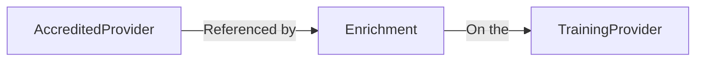
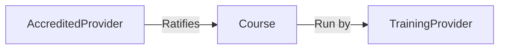

# 12. Formalize Accredited provider relationships

Date: 23/10/24

## Status

**Proposal**

Create a conventional relational association between Providers to replace the existing association that exists in a jsonb column on the model.

### Terminology

Some terms are overlapping. It depends on the context in which they are used.

E.G. 

> An Accredited provider can be a Training provider and the Ratifying provider for their own courses.

| Term                | Explanation                                                                                                                        |
| ---                 | ---                                                                                                                                |
| Accredited provider | A HEI or SCITT that has been given the responsibility to recommend QTS for training courses run by themselves or a Lead partner.   |
| Training partner    | Any provider that runs ITT courses directly. <br> Could be an Accredited provider. Used when talking about provider relationships. |
| Training provider   | Training partner but used when discussing roles in terms of course running / ratifying.                                            |
| Lead partner        | A provider that runs ITT courses that are ratified by an Accredited provider. By definition, not an Accredited provider.           |
| Ratifying provider  | The Accredited provider that ratifies a training course on behalf of a Training partner.                                           |

| Technical Term | Explanation                                                                     |
| ---            | ---                                                                             |
| Relationship   | Non-technical term to describe how two entites are joined conceptually          |
| Association    | Technical term to describe how a relationship exists in the codebase / database |

### Technical Assumptions

1. A provider is an Accredited provider if the value in the `accrediting_provider` column is `'Y'`
2. A provider is not an Accredited provider if the value in the `accrediting_provider` column is `'N'`
3. A Course must either be run by an Accredited provider |or| reference an Accredited provider (via `courses.accredited_provider_code`)
4. There must exist an accredited provider relationship (Partnership) between the Training partner and the Accredited provider for the Courses' Ratifying provider to be valid.
5. A course run by an accredited provider does not need to reference the accredited provider explicitly, the Ratifying provider is implied.

### Provider partnerships

The structural and conceptual relationships among and between providers and users has changed in many ways since this codebase was started.[[1]]

A Lead partners' courses must be ratified by an Accredited provider. This is done be setting the `accredited_provider_code` on the Course model.

In order for a Lead partner to assign an Accredited provider as the Ratifying provider for their course they must create a partnership with the Accredited provider.

This relationship is currently formed when a Lead partner adds an Accredited provider to their list of Accredited providers. 

In data terms, we create an entry in the `accredited_provider_enrichments` column on the Lead partners `Provider` record.

#### Training partner / Accredited provider association



Once the Partnership is created then the Lead partner can choose the Accredited provider to ratify their course.

#### Training partner / Accredited Provider Course Ratification association


#### 'Organisations' (within publish)

Publish used to employ a system of 'Organisations'. A number of providers would be grouped by all being a member of an Organisation. 
Users would also be members of the organisation by association. This architecture has been abandoned but there are still remnants of this system in the codebase. How this system could be used to model the provider relationships is unclear at this time.

The external documentation actually refers to this grouping as a [Partnership](https://assets.publishing.service.gov.uk/media/64c7922619f562000df3c103/ITT_forming_partnerships_guidance_-_August_2023.pdf). The term Organisation refers to what the publish code base calls a Provider, so there is an inconsistency here in terminology.

These partnerships can be complicated because a single Training partner can have courses ratified by different Accredited providers and so, therefore, can be in more than one Partnership.

The Publish-specific concept of an Organisation may develop into something that incorporates partnerships in future but there is not enough understanding of the existing partnership structures to model them holistically.

### Current technical implementation of the provider relationships

We have a database table `provider` that has an implicit self-join relationship based on another column `accrediting_provider`.
The association exists through a column called `accredited_provider_enrichments`.

The association that currently exists is unconventional with respect to a normalised relational database.

This is explained more in [Option 1](#1.-leave-the-relationships-as-they-are).

This ADR proposes we create a conventional relationship model between associated provider records. This change is necessary so we can to begin manage these relationships within the system. We will then be able to interrogate, describe and constrain effectively.


### Evolving relationship

Providers have always had a relationship between one another in the form of course accreditation. More recently, this relationship has been extended to delegating this accreditation.


#### Three levels of providers scenario

Accredited provider A1

Accredited provider A2

Training provider T1


 - A2 has an accredited provider relationship with A1. A1 is the accredited provider in this relationship.
 - A2 is the accredited provider for T1. T1 courses are accredited by A2.
 - A2 runs ITT courses and self accredits those courses.

We have Accredited provider relationships that exist solely for organisational reasons. This happens when: 


| Provider | Is accredited? | Is accredited by |
| ---      | ---            | ---              |
| A1       | Yes            | -                |
| A2       | Yes            | A1               |
| B1       | No             | A2               |


| Provider | Is accredited? | "Can ratify courses for" |  Who ratifies their courses? |
| ---      | ---            | ---                |  ---                         |
| C76      | Yes            | -                  |  No courses                  |
| 2DB      | Yes            | C76                |  C76 (all)                   |
| 1AV      | No             | 2DB                |  2DB (all)                   |


This relationship does not exist outside of Publish in concrete terms. 

Example of this relationship structure being requested:
 - https://github.com/DFE-Digital/publish-teacher-training/pull/4589/files
 - https://github.com/DFE-Digital/publish-teacher-training/blob/b7fcf16c39e087706d2b076c3515c7a946126a45/db/data/20241011081455_update_accredited_providers.rb

This could constitute an abuse of the established format for Accredited provider relationships, or a mislabelling of the relationship.

As of this ADR, it is not acceptable to have an accredited providers' courses ratified by another accredited provider.

The updated association would allow us to easily mitigate against this type of relationship occurring.

## Options

### 1. Leave the relationships as they are

A Training provider stores their Accredited provider partnership in a serialized JSON column called `accredited_provider_enrichments`. The primary key is stored as a property in this serialized string. This columns is of type `jsonb` but the json type of the value is `string`, not `object` using a key that is outdated and misleading `'UcasProviderCode'`.


```
manage_courses_backend_development=# select jsonb_typeof(accrediting_provider_enrichments) from provider limit 1;
 jsonb_typeof
--------------
 string
(1 row)
```

The reason the value is not stored as jsonb type is becuase we are using serialization to serialize the value before passing it to postgres.

```ruby 
serialize :accrediting_provider_enrichments, coder: AccreditingProviderEnrichment::ArraySerializer
```

An enrichment looks like this:

```json
{"UcasProviderCode":"D39","Description":"About University of Derby\r\n\r\nThe University of Greenwich are our school based partners who will deliver the training and award the PGCE. The curriculum is accredited and QTS recommended by The University of Derby.","validation_context":null}
```

It has two properties `UcasProviderCode` which is the Accredited provider code, and `Description` which describes the relationship between the two providers.

The following is all the methods and configuration required to use the existing association. Much of this is built into conventional Rails associations.

```ruby
class Provider < ApplicationRecord
  def accredited_providers
    recruitment_cycle.providers.where(provider_code: accredited_provider_codes)
  end

  serialize :accrediting_provider_enrichments, coder: AccreditingProviderEnrichment::ArraySerializer

  alias accrediting_providers accredited_providers

  # the providers that this provider is an accredited_provider for
  def training_providers
    Provider.where(id: current_accredited_courses.pluck(:provider_id))
  end

  def current_accredited_courses
    accredited_courses.includes(:provider).where(provider: { recruitment_cycle: })
  end

  def accredited_body(provider_code)
    accrediting_provider_enrichment = accrediting_provider_enrichments&.find { |enrichment| enrichment.UcasProviderCode == provider_code }

    return unless accrediting_provider_enrichment

    accredited_provider = recruitment_cycle.providers.find_by(provider_code:)

    return if accredited_provider.blank?

    {
      accredited_provider_id: accredited_provider.id,
      description: accrediting_provider_enrichment.Description || ''
    }
  end

  def accredited_bodies
    accrediting_provider_enrichments&.filter_map do |accrediting_provider_enrichment|
      provider_code = accrediting_provider_enrichment.UcasProviderCode

      accredited_provider = recruitment_cycle.providers.find_by(provider_code:)

      if accredited_provider.present?
        {
          provider_name: accredited_provider.provider_name,
          provider_code: accredited_provider.provider_code,
          description: accrediting_provider_enrichment.Description || ''
        }
      end
    end || []
  end

  def add_enrichment_errors
    accrediting_provider_enrichments&.each do |item|
      provider_code = item.UcasProviderCode

      accredited_provider = recruitment_cycle.providers.find_by(provider_code:)

      if accredited_provider.present? && item.invalid?
        message = "^Reduce the word count for #{accredited_provider.provider_name}"
        errors.add :accredited_bodies, message
      end
    end
  end

  def accredited_provider_codes
    accrediting_provider_enrichments&.map(&:UcasProviderCode) || []
  end

    ...

class Course < ApplicationRecord

  def accrediting_provider_description
    return if accrediting_provider.blank?
    return if provider.accrediting_provider_enrichments.blank?

    accrediting_provider_enrichment = provider.accrediting_provider_enrichments
                                              .find do |provider|
      provider.UcasProviderCode == accrediting_provider.provider_code
    end

    accrediting_provider_enrichment.Description if accrediting_provider_enrichment.present?
  end
```

#### Pros

- No effort expended and other work can be prioritised

#### Cons

- Leaves the data in an under constrained state
- Inability to query easily through the association
- Inefficient methods for querying entity relationships
- Slows down the onboarding of developers while they understand this unconventional association

### 2. Create typical self-join has_many through pivot table relationship

```ruby
class Provider < ApplicationRecord
  has_many :accredited_accreditations,
           class_name: 'ProviderAccreditation',
           foreign_key: :training_provider_id

  has_many :training_accreditations,
           class_name: 'ProviderAccreditation',
           foreign_key: :accredited_provider_id

  has_many :accredited_providers,
           through: :accredited_accreditations,
           source: :accredited_provider,
           class_name: 'Provider'

  has_many :training_providers,
           through: :training_accreditations,
           source: :training_provider,
           class_name: 'Provider'

  validates :training_providers, uniqueness: true
  validates :accredited_providers, uniqueness: true
  validates_associated :accredited_providers
  validates_associated :training_providers

class ProviderAccreditation < ApplicationRecord

  validates :accredited_provider_id, :training_provider_id, presence: true
  validates :correct_types

  def correct_types
    errors.add(:accredited_provider_is_not_accredited) unless accredited_provider.accredited?
    errors.add(:training_provider_can_not_be_accredited) if training_provider.accredited?
  end

...

training_provider = Provider.find(1)

training_provider.accredited_providers
# => [Provider, Provider]

accredited_provider = Provider.find(1)
accredited_provider.training_providers
# => [Provider, Provider]

```

#### Pros

- Eases the burden of onboarding developers
- Query the Training provider / Accredited provider relationships through typical relational associations
- Index the columns used to make these queries.
- Avoid creating more than one association between two providers (unique constraint)
- More formally distinguish Accredited and accrediting providers. (terms currently used in the codebase)
- Database validations (if desired) on which Accredited providers can accredit which courses.
- Opportunity to clarify definitions and understand how we are using them.

#### Cons

- Adding more tables to the database
- Cost of implementation and maintenence


## Decision

The change option that we're proposing or have agreed to implement.

## Consequences

What becomes easier or more difficult to do and any risks introduced by the change that will need to be mitigated.

<!-- References -->
[1]: https://becoming-a-teacher.design-history.education.gov.uk/becoming-a-teacher/understanding-the-relationships-between-organisations-delivering-initial-teacher-training/
