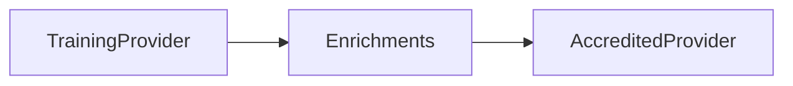
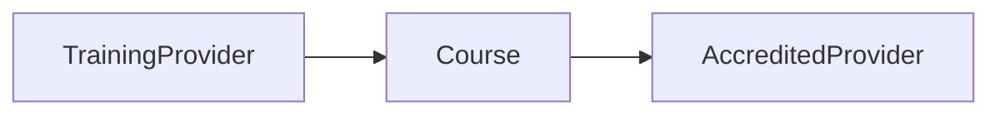

# 12. Formalize Accredited Provider relationships

Date: 23/10/24

## Status

Proposal

## Context

We have a database table `provider` that has an implicit self-join relationship based on another column `accrediting_provider`.

The relationship that currently exists is unconventional with respect to a normalised relational database.

Making the relationship more conventional will allow us to query, validate and enforce the relationships easily and will reduce the uncertainty about the nature of this relationship.


### Organisations

Publish used to employ a system of Organisations. A number of Providers would be grouped by all being a member of an organisation. 
Users would also be members of the organisation.


### Misuse of the existing relationships

We have seen Accredited provider relationships that exist solely for organisational reasons. This happens when Accredited provider A1 is an accredited provider for provider A2 but there is no expectation or intention for A1 to be the accredited provider for courses run by A2. This feels like an abuse of the accredited provider association.

### Definitions

 - A Training Provider
     * A provider that runs training courses directly.
     * |or|
     * A provider that has an subordinate assocation to another provider (accredited).
 - An Accredited Provider
     * A provider that has an authoratative assocation to another provider (training).
 - Accrediting Provider
     * A provider that accredits one or more courses on behalf of one or more training provider.
 - An Accredited Provider Relationship
     * A directional association between an accredited provider and another provider.

An Accredited provider can run training courses, meaning they are a training provider and an accredited provider.

An Accredited provider can be accredited by another accredite provider.

#### Three levels of providers scenario

Accredited provider A1

Accredited provider A2

Training provider T1


```mermaid
flowchart LR;
T1
A2
A1

T1 --> A2 --> A1;
```

 - A2 has an accredited provider relationship with A1. A1 is the accredited provider in this relationship.
 - A2 is the accredited provider for T1. T1 courses are accredited by A2.
 - A2 runs training courses and self accredits those courses.


### Assumptions

1. A provider is an Accredited provider if the value in the `accrediting_provider` column is `'Y'`
2. A provider is not an Accredited provider if the value in the `accrediting_provider` column is `'N'`
3. A Course must either be run by an Accredited provider |or| reference an Accredited provider (via `courses.accredited_provider_code`)
4. There must exist an accredited provider relationship between the training provider and the accredited provider for the Course accredited provider to be valid.


### Training Provider -> Accredited Provider association


```mermaid
flowchart LR;
TrainingProvider --> Enrichments --> AccreditedProvider;
```

### Course -> Accredited Provider association

```mermaid
flowchart LR;
TrainingProvider --> Course --> AccreditedProvider;
```

## Options

### 1. Leave the relationships as they are

A training provider stores their accredited provider relationships in a serialized JSON column called `accredited_provider_enrichments`. The primary key is stored as a property in this serialized string. This columns is of type `jsonb` but the json type of the value is `string`, not `object` using a key that is outdated and misleading `'UcasProviderCode'`.

```
manage_courses_backend_development=# select jsonb_typeof(accrediting_provider_enrichments) from provider limit 1;
 jsonb_typeof
--------------
 string
(1 row)
```

This requires us to pattern match the string to find a training providers accredited provider associations. We cannot coerce the value to a jsonb object (array) because of the quote escaping in the stored string.


```ruby
class Provider < ApplicationRecord
  enum :accrediting_provider, {
    accredited_provider: 'Y',
    not_an_accredited_provider: 'N'
  }

  has_and_belongs_to_many :organisations, join_table: :organisation_provider

  has_many :users_via_organisation, -> { kept }, through: :organisations, source: :users

  has_many :user_permissions
  has_many :users, -> { kept }, through: :user_permissions

  def accredited_providers
    recruitment_cycle.providers.where(provider_code: accredited_provider_codes)
  end

  serialize :accrediting_provider_enrichments, coder: AccreditingProviderEnrichment::ArraySerializer

  alias accrediting_providers accredited_providers
  alias accredited? accredited_provider?

  # the providers that this provider is an accredited_provider for
  def training_providers
    Provider.where(id: current_accredited_courses.pluck(:provider_id))
  end

  def current_accredited_courses
    accredited_courses.includes(:provider).where(provider: { recruitment_cycle: })
  end

  def accredited_body(provider_code)
    accrediting_provider_enrichment = accrediting_provider_enrichments&.find { |enrichment| enrichment.UcasProviderCode == provider_code }

    return unless accrediting_provider_enrichment

    accredited_provider = recruitment_cycle.providers.find_by(provider_code:)

    return if accredited_provider.blank?

    {
      accredited_provider_id: accredited_provider.id,
      description: accrediting_provider_enrichment.Description || ''
    }
  end

  def accredited_bodies
    accrediting_provider_enrichments&.filter_map do |accrediting_provider_enrichment|
      provider_code = accrediting_provider_enrichment.UcasProviderCode

      accredited_provider = recruitment_cycle.providers.find_by(provider_code:)

      if accredited_provider.present?
        {
          provider_name: accredited_provider.provider_name,
          provider_code: accredited_provider.provider_code,
          description: accrediting_provider_enrichment.Description || ''
        }
      end
    end || []
  end

  def add_enrichment_errors
    accrediting_provider_enrichments&.each do |item|
      provider_code = item.UcasProviderCode

      accredited_provider = recruitment_cycle.providers.find_by(provider_code:)

      if accredited_provider.present? && item.invalid?
        message = "^Reduce the word count for #{accredited_provider.provider_name}"
        errors.add :accredited_bodies, message
      end
    end
  end

  def accredited_provider_codes
    accrediting_provider_enrichments&.map(&:UcasProviderCode) || []
  end

    ...

class Organisation < ApplicationRecord
  has_many :organisation_users

  has_many :users, through: :organisation_users

  has_and_belongs_to_many :providers

    ...

class Course < ApplicationRecord

  def accrediting_provider_description
    return if accrediting_provider.blank?
    return if provider.accrediting_provider_enrichments.blank?

    accrediting_provider_enrichment = provider.accrediting_provider_enrichments
                                              .find do |provider|
      provider.UcasProviderCode == accrediting_provider.provider_code
    end

    accrediting_provider_enrichment.Description if accrediting_provider_enrichment.present?
  end
```
#### Pros

- No effort expended and other work can be prioritised

#### Cons

- Consuses eases burden of onboarding developers
- Leaves the data in an under contrained state
- Inefficient methods for querying entity relationships

### 2. Create typical self-join has_many through pivot table relationship

```ruby
class Provider < ApplicationRecord
  has_many :accredited_accreditations,
           class_name: 'ProviderAccreditation',
           foreign_key: :training_provider_id

  has_many :training_accreditations,
           class_name: 'ProviderAccreditation',
           foreign_key: :accredited_provider_id

  has_many :accredited_providers,
           through: :accredited_accreditations,
           source: :accredited_provider,
           class_name: 'Provider'

  has_many :training_providers,
           through: :training_accreditations,
           source: :training_provider,
           class_name: 'Provider'
```

#### Pros

- Query the training provider / accredited provider relationships through typical relational associations
- Index the columns used to make these queries.
- More formally distinguish accredited and accrediting providers.
- Database validations (if desired) on which accredited providers can accredit which courses.
- Opportunity to clarify definintions and understand how we are using them.

#### Cons

- None!


### 3. Replicate the Apply User / Provider Relationship model

```ruby
class ProviderRelationshipPermissions < ApplicationRecord
  belongs_to :ratifying_provider, class_name: 'Provider'
  belongs_to :training_provider, class_name: 'Provider'

    ...

class Provider < ApplicationRecord
  has_many :provider_permissions, dependent: :destroy
  has_many :provider_users, through: :provider_permissions
  has_many :training_provider_permissions, class_name: 'ProviderRelationshipPermissions', foreign_key: :training_provider_id
  has_many :ratifying_provider_permissions, class_name: 'ProviderRelationshipPermissions', foreign_key: :ratifying_provider_id

    ...

class Course < ApplicationRecord
  belongs_to :provider
  belongs_to :accredited_provider, class_name: 'Provider', optional: true

    ...
```

#### Pros

- Consistency between the two services
- Could we sync users and their permissions?

#### Cons

- None!

## Decision

The change option that we're proposing or have agreed to implement.

## Consequences

What becomes easier or more difficult to do and any risks introduced by the change that will need to be mitigated.
