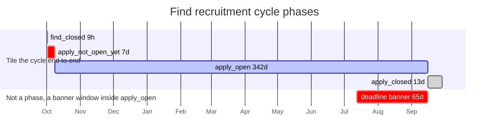
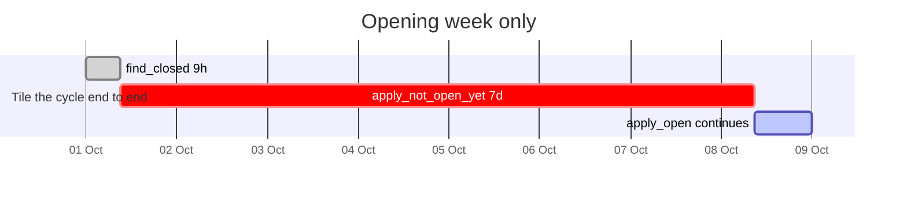

# Recruitment cycle phases

Find describes where it is in the recruitment cycle with four phases, declared in
`Find::CycleTimetable::PHASES` (`app/services/find/cycle_timetable.rb`).

**A phase is a span where what a person can do differs.** Find is up or down. Apply
takes a submission or it does not. A span where only the wording on the page changes
is not a phase. That test is what keeps the table to four rows.

They tile the cycle end to end, with no gap and no overlap. At any instant exactly one
row is live. Nothing nests inside anything else, so the cycle switcher can force a
phase and turn on that phase alone.

`PHASES` lists them in the order a cycle runs, starting from Apply closing:
`apply_closed`, `find_closed`, `apply_not_open_yet`, `apply_open`. It says nothing
about the cycle switcher.

## What the switcher offers

Which cycle year an option loads is the switcher's business, not a phase's, so it
lives in `SWITCHER_OPTIONS`. An option is a phase plus the cycle it loads, which lets
two options name the same phase:

| option | phase | loads |
| --- | --- | --- |
| `apply_open` | `apply_open` | the cycle running now |
| `apply_closed` | `apply_closed` | the cycle running now |
| `find_closed` | `find_closed` | the cycle after the rollover |
| `apply_not_open_yet` | `apply_not_open_yet` | the cycle after the rollover |
| `apply_reopened` | `apply_open` | the cycle after the rollover |

The list is one walk: this cycle finishes, then the next one starts. The divider falls
where the cycle year first changes, so the current cycle's two options come first and
the next cycle's three follow. `apply_open` and `apply_reopened` are the same phase
seen from either side of the rollover, which is why the switcher can show Apply open
for the cycle you are standing in as well as for the one coming.

`real` is the sixth radio, and it is the only setting that reads the clock. Anything
else held in Redis that is not one of the five options, such as a name an earlier
deploy used, reads as `real` too, because a value that matched no phase would leave
every predicate false and the service with no apply button and no banner to explain
it.

The apply deadline banner is deliberately not a row. It is a window inside
`apply_open`, and the switcher toggles it on its own axis. The other two banners need
no such control, because each covers exactly one phase: picking the phase produces the
banner, and a separate toggle would let the switcher show states the service cannot.

## Asking the timetable

`CycleTimetable` has one predicate per phase, `find_closed?`, `apply_not_open_yet?`,
`apply_open?` and `apply_closed?`. Everything else is written in terms of those, so a
span has one source of truth and each caller keeps a name that says why it is asking:
`show_cycle_closed_banner?` in the banner component, `apply_deadline_passed` in the
controllers, `can_create_application?` at the apply button. The lookup underneath,
`phase_in_time?`, is private, so a phase key never travels outside the class.

The dates below are placeholders. Every cycle has this shape, and only the exact dates
move from year to year.

## The six boundaries

There are six moments in a cycle where behaviour changes, and one of them is not a date
in `CYCLE_DATES`. Worked through with cycle 2026:

```
A  30 Sep 2025 00:00   find_opens(2026).beginning_of_day   implicit
B  30 Sep 2025 09:00   find_opens(2026)
C   7 Oct 2025 09:00   apply_opens(2026)
D  12 Jul 2026 09:00   first_deadline_banner(2026)
E  15 Sep 2026 18:00   apply_deadline(2026)
F  28 Sep 2026 23:59   find_closes(2026)
```

Four of the six are phase edges. A and D are not. A rolls the cycle year, D changes a banner.

### A. Midnight, nine hours before Find opens

Nothing changes on Find, which is still shut, and no phase begins. But
`cycle_year_for_time` rolls the cycle year here, not at B, so `current_year` becomes
2026 and with it:

- which courses load, through `Courses::PublishRules::LiveOnFind`, `Courses::Query` and
  `Find::PreviousCycleCourse`
- which years the router accepts, through `CycleYearConstraint`
- `RecruitmentCycle.current`
- the targets of `find_reopens` and `apply_reopens`, which are both defined as
  `next_year` arithmetic

That last one is why the closed-cycle copy moves a year during these nine hours.

`find_closed` spans this boundary rather than starting at it. It runs from F of the
previous cycle, which is when Find actually shuts, and is indexed by the cycle it leads
into, because A puts all but a sliver of those nine hours in that cycle.

### B. Find opens

- `find_closed?` goes false, so `Find::ApplicationController#redirect_to_cycle_has_ended_if_find_is_down`
  stops sending every Find page to `/cycle-has-ended`
- `find_closed` ends and `apply_not_open_yet` begins
- `can_create_application?` goes true, so the apply button renders in place of the
  end-of-cycle notice (`app/views/find/courses/show.html.erb`,
  `app/views/publish/courses/preview.html.erb`, `Find::Courses::ApplyComponent`)
- `show_apply_opens_soon_banner?` goes true
- a saved course gains a grey "Not yet open" tag, through `CourseDecorator#saved_status_text_and_colour`
- `RecruitmentCycle#current_and_open?` goes true, so Publish's cycle title changes from
  "New cycle" to "Current cycle"
- Publish's sign in page and course list drop their find-is-down notice
- `Find::DeadlineBannerComponent` starts rendering at all, since it renders only when
  Find is up

### C. Apply opens

- `apply_not_open_yet` ends and `apply_open` begins
- `mid_cycle?` goes true, the stable open stage
- the apply-opens-soon banner disappears
- the grey "Not yet open" tag disappears

Nothing else in this codebase. The real change happens in the Apply service, which
starts accepting submissions. Before this moment a candidate can already create an
application and work on it, which is why the apply button is shown from B rather than
from C.

### D. First deadline banner

- the layout banner switches to the apply-by-deadline variant
- `mid_cycle?` goes false, since a banner is now up. Nothing in the app branches on
  this, and the apply button is unaffected: it reads `can_create_application?`

No phase begins or ends here. `apply_open` keeps running.

Nothing else.

### E. Apply deadline

- `apply_open` ends and `apply_closed` begins
- `can_create_application?` goes false, so the apply button is replaced by the
  end-of-cycle notice
- `apply_deadline_passed` goes true, so a saved course gains a red "Not accepting
  applications" tag, and `apply_action_column_class` widens the apply row to full width
  in both `Find::CoursesController` and `Publish::CoursesController`, behind the
  `candidate_accounts` feature flag
- the layout banner switches to the closed variant
- `preview_mode?` goes true, though nothing outside `CycleTimetable` reads it

Find stays open and every course stays browsable.

### F. Find closes

- `find_closed?` goes true, so all of Find redirects to `/cycle-has-ended`
- `apply_closed` ends and the next cycle's `find_closed` begins
- `current_and_open?` goes false, so Publish's title reverts to "New cycle" and the two
  Publish views show their notice again
- `Find::DeadlineBannerComponent` stops rendering

The cycle year does not change here. It changes nine hours later, at A.

## The two windows where Find is open and Apply is shut

B to C and E to F both leave Find open with Apply shut, but that is a coincidence of two
booleans rather than a shared state. They agree on nothing else.

| | `apply_not_open_yet`, seven days | `apply_closed`, thirteen days |
| --- | --- | --- |
| Apply has | not opened yet | shut for good |
| Candidate can create an application | yes | no |
| Candidate can submit one | no | no |
| Courses on display | the cycle just starting | the cycle just ending |
| Banner | prepare now, submit from `apply_opens` | the deadline has passed |
| Saved-course tag | grey, "Not yet open" | red, "Not accepting applications" |
| Apply button | shown | hidden |

One is anticipation and one is termination. They point at different cycles and give
opposite advice. The names say which is which: not open yet against closed.

## What gates the apply button

`can_create_application?` does, and it is the OR of `apply_not_open_yet` and
`apply_open`, so it runs from B to E. It reads two phases because no single phase
answers it:

> can a candidate create an application for the cycle currently on display?

C changes whether Apply will take the finished application, but inside Find it changes
only what the page says about the wait. When this is false the apply button is replaced
by the end-of-cycle notice, which tells candidates the courses are closed and gives them
next cycle's reopening dates, so it must stay true for the whole of B to E including the
deadline banner window.

`mid_cycle?` is a different question and gates nothing:

> is this the stable open stage, Apply taking applications and no banner up?

It is `apply_open` with the deadline banner not yet up, so C to D. It exists to name
the ordinary state, and `mid_cycle`, the instant, sits inside it.

## The full cycle



## The opening week

`find_closed` lasts nine hours, which is 0.1% of the cycle, so it cannot be seen on the
chart above. This chart covers the first eight days only.



## What the placeholder dates stand for

| Date in the charts | Boundary in `CYCLE_DATES` |
| --- | --- |
| `2000-09-30 23:59` | `find_closes` of the previous cycle, boundary F of that cycle |
| `2000-10-01 00:00` | `find_opens` at midnight, boundary A, no phase edge |
| `2000-10-01 09:00` | `find_opens` |
| `2000-10-08 09:00` | `apply_opens` |
| `2001-07-12 09:00` | `first_deadline_banner` |
| `2001-09-15 18:00` | `apply_deadline` |
| `2001-09-28 23:59` | `find_closes` |

## Phase extents

| Phase | Runs from | Runs to | Overlap |
| --- | --- | --- | --- |
| `find_closed` | `find_closes` of the previous cycle | `find_opens` | none |
| `apply_not_open_yet` | `find_opens` | `apply_opens` | none |
| `apply_open` | `apply_opens` | `apply_deadline` | none |
| `apply_closed` | `apply_deadline` | `find_closes` | none |

Consecutive rows share a boundary, so `phases_in_time` reads each row as half-open:
the shared instant belongs to the row that opens on it. At `apply_deadline` the live
phase is `apply_closed`, not `apply_open`.

The deadline banner is not in this table. It runs `first_deadline_banner` to
`apply_deadline`, inside `apply_open`, and `show_apply_deadline_banner?` reads it.

`find_closed` is the only row that spans two entries of `CYCLE_DATES`, because Find
shutting and Find reopening are the seam between two cycles. Every other row reads one
cycle's dates.

Two names carry the words "mid cycle", and they do not mean the same span:

| Name | Meaning |
| --- | --- |
| `mid_cycle(year)` | an instant, `apply_opens` plus two months, the stable open stage, used as the default clock for unpinned specs |
| `mid_cycle?` | a predicate, `apply_open` with no deadline banner up, so `apply_opens` to `first_deadline_banner` |
