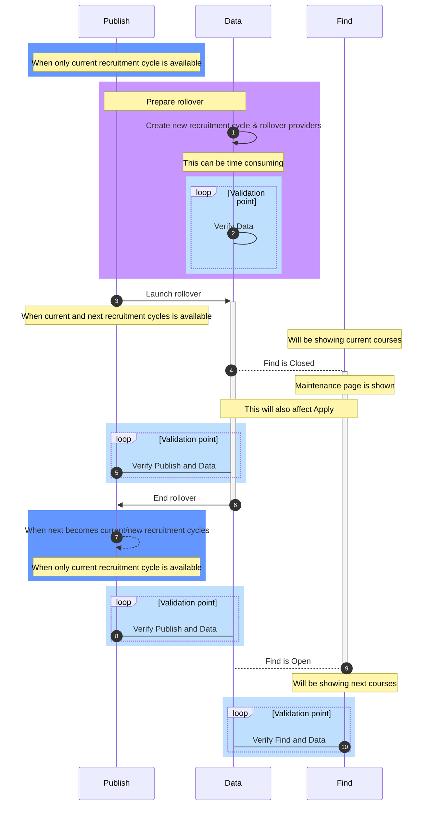

# Rollover

Each year we close the current cycles courses and open the new cycle in a process we call `Rollover`.


This involves copying existing providers and courses to new records to allow the
providers to update any details and then switching the API over to a new
`recruitment cycle` which in turn releases the new courses on `Find` & `Apply`.

This document lists the changes needed to be made to the codebase and the 
timings for these changes. 

## Rollover overview

The below sequence diagram covers an approximately 4 month period of time ending around `October`.
It covers 
1. when there is only `current` recruitment cycle to `current` and `next` recruitment cycles then 
back to `current/new` recruitment cycle.
2. the rollover cycle from `prepare` to `launch` to `end`.
3. the period where `Find` closes and reopens with new courses.
4. the 4 main Validation points to validate the `data`, `Publish` and `Find` for the dry run testing.


### Dry run / full process
1. Create new recruitment cycle & rollover providers
2. Verify Data issues
  a. Overtime the data discrepancies maybe introduced, which may lead to rollover process experiencing issues.
3. Launch rollover
4. Find is Closed
5. Verify Publish and Data issues 
  a. Overtime the data discrepancies maybe introduced, which may lead to Publish experiencing (mainly UI) issues. 
6. End rollover    
7. When next becomes current recruitment cycles 
8. Verify Publish and Data issues 
  a. Overtime the data discrepancies maybe introduced, which may lead to Publish experiencing (mainly API) issues.
9. Find is Open
10. Verify Find and Data issues
  a. Overtime the data discrepancies maybe introduced, which may lead to Find experiencing issues.

> 3,4,6 and 9 are most likely going to be time sensitive.
## Testing the Rollover process

This should happen every year in good time to allow for any code
updates/refactoring work.

1. Ensure that **testing environments** are set up for Publish and Find. 
  (A minimum of 3gb ram is recommended for Publish)

2. Begin a test Rollover by running through the steps in
  [On Rollover launch date](#on-rollover-launch-date).

   You'll need a new `RecruitmentCycle` for the next cycle, to create this,
   run `bundle exec rake rollover:create_recruitment_cycle"[YYYY, "YYYY-MM-DD", "YYYY-MM-DD"]"`.
   This is `year`, `application_start_date` and `application_end_date` respectively.
   You might not know the `application_start_date` and `application_end_date` in time for 
   testing, so just use sensible placeholders.

3. Test Publish, Publish public v1 endpoints, and Publish support console.
> This covers 1 to 5 from the above Rollover overview diagram

4. End the test Rollover by running through the steps in
  [On Rollover end date](#on-rollover-end-date).

5. Test Publish, Publish public v1 endpoints, and Publish support console, and Find.
> This covers 6 to 10 from the above Rollover overview diagram

6. **Reverse the Rollover** if further testing needed. It might be easiest to
  reset the testing database at this point to remove the rolled-over providers.

7. **Update this document** with any missing steps/changes identified.

## On Rollover launch date
### Prior Rollover launch date
1. Create a new `RecruitmentCycle` with the correct `year`, `application_start_date` and `application_end_date` by 
running:

    ```bash
    bundle exec rake 'rollover:create_recruitment_cycle"[YYYY, "YYYY-MM-DD", "YYYY-MM-DD"]'
    # example
    bundle exec rake 'rollover:create_recruitment_cycle[2023, "2022-10-11", "2023-09-29"]'
    ```

2. Rollover providers by running:

    ```bash
    bundle exec rake rollover:providers
    ```

3. Create a **Start Rollover PR** including the following code changes:
    - Update the setting for `can_edit_current_and_next_cycles: true`
    - Any hardcoded copy changes

### Begin Rollover launch

1. Verify the dates on `Find` [CycleTimetable](https://github.com/DFE-Digital/find-teacher-training/blob/ae89dee0415679422b8e7af52543fdb1df83689d/app/services/cycle_timetable.rb#L2)

2. Merge the **Start Rollover PR**

## During Rollover

1. Create an **End Rollover PR** including the following code changes:
    - Update the setting for `can_edit_current_and_next_cycles: false`
    - Any hardcoded copy changes
    - Increment setting `current_recruitment_cycle_year`
    - Increment year in setting `next_cycle_open_date`


## On Rollover end date

1. Merge the **End Rollover PR**

2. Complete the steps on `Find`
